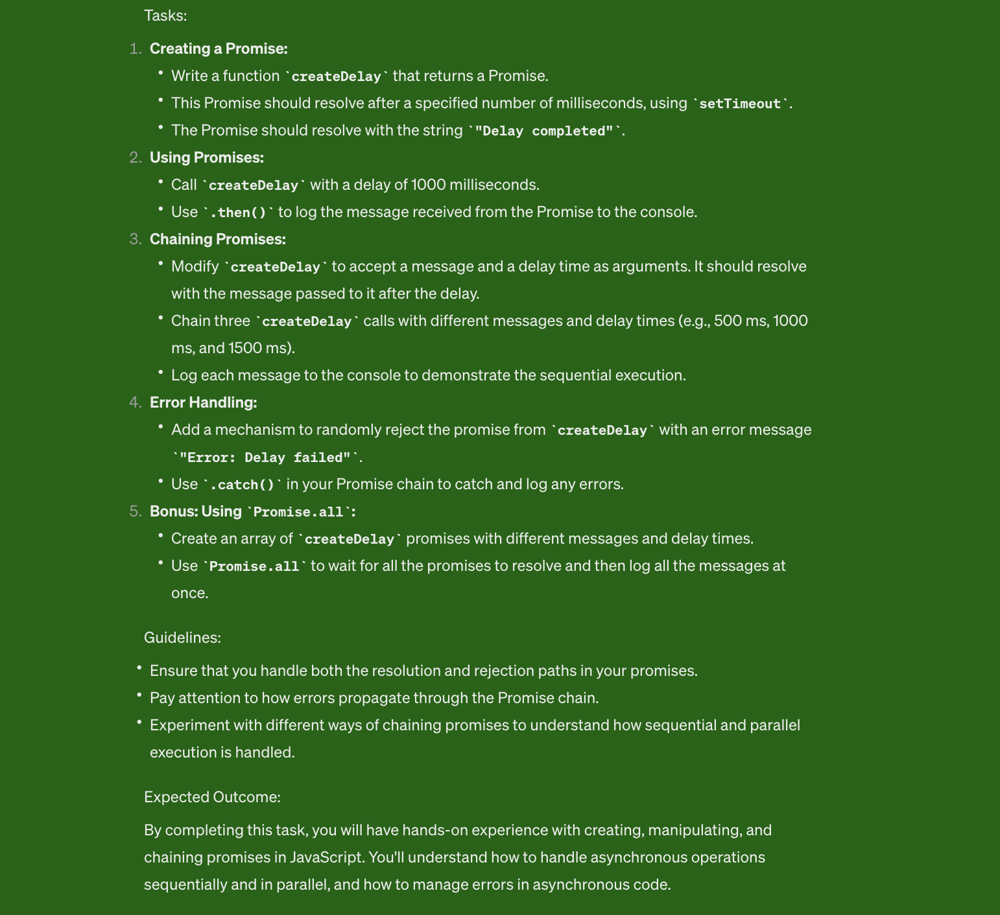

# JavaScript Asynchronous Programming Tasks

This repository contains various tasks designed to help you learn and practice asynchronous programming concepts in JavaScript. It includes code examples and exercises that cover asynchronous features such as callbacks, promises, async/await, setTimeout, and setInterval.

## Table of Contents
- Task 1: Creating a Promise
- Task 2: Using Promises
- Task 3: Chaining Promises
- Task 4: Error Handling
- Task 5: Bonus: Using Promise.all

